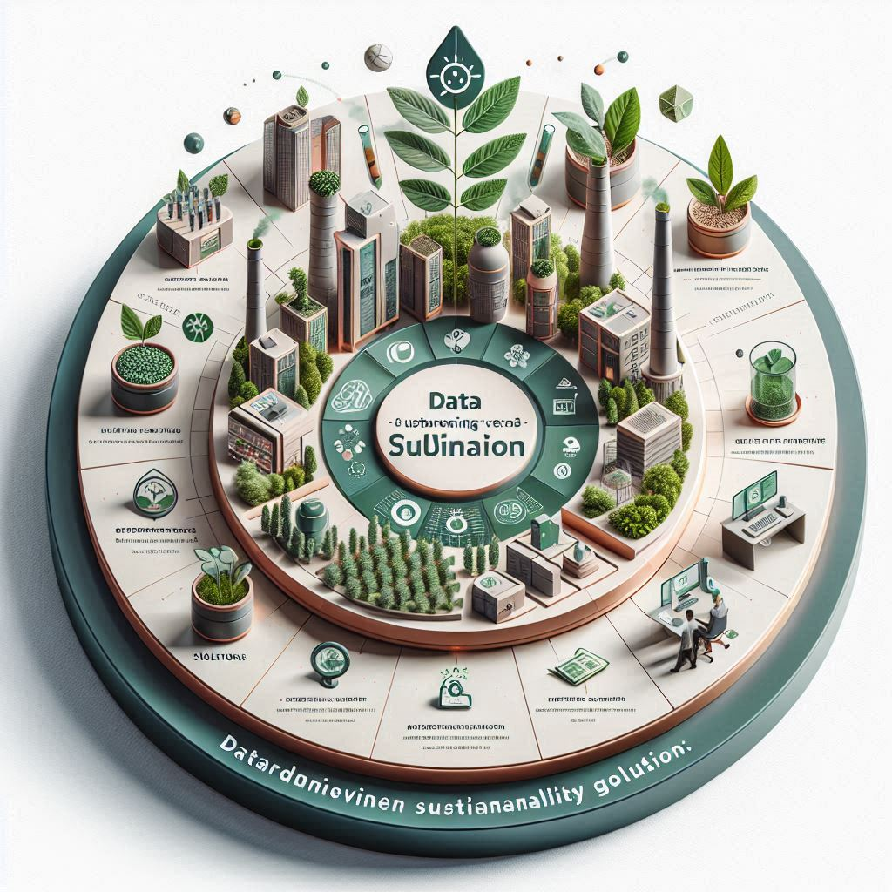
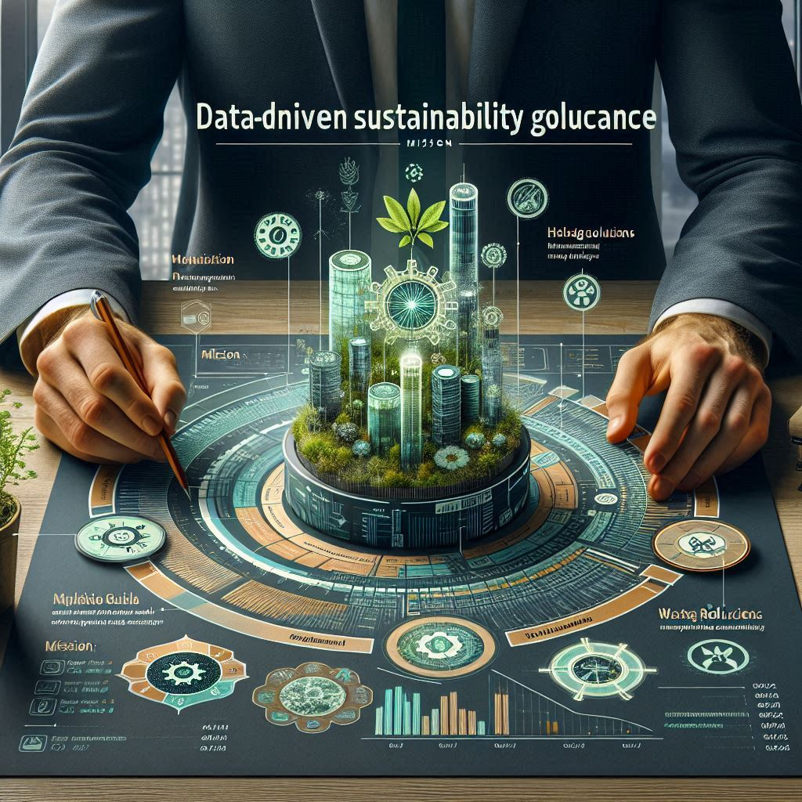
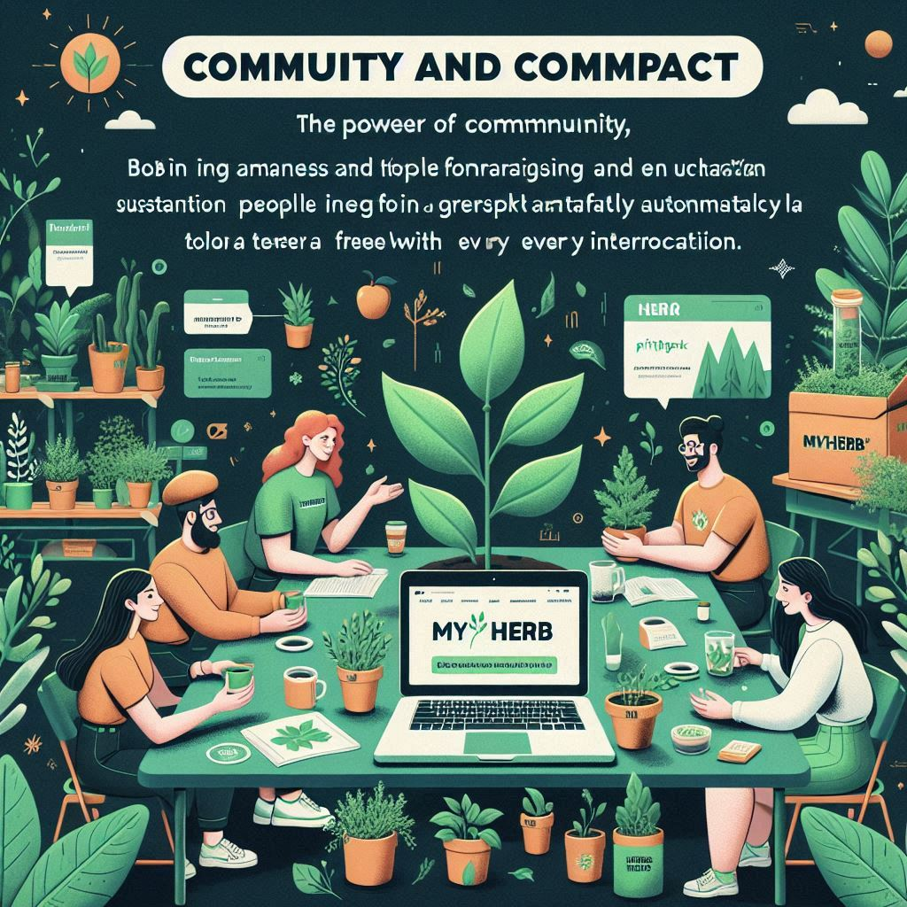
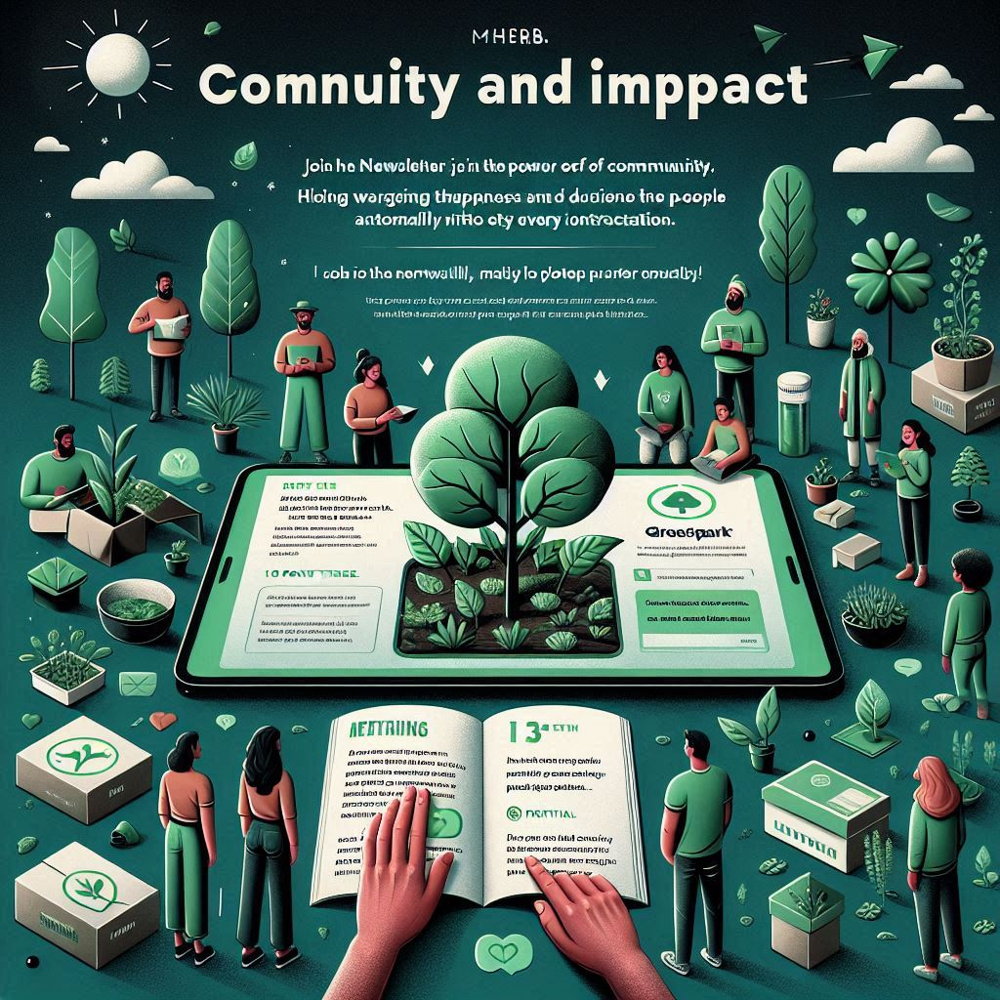
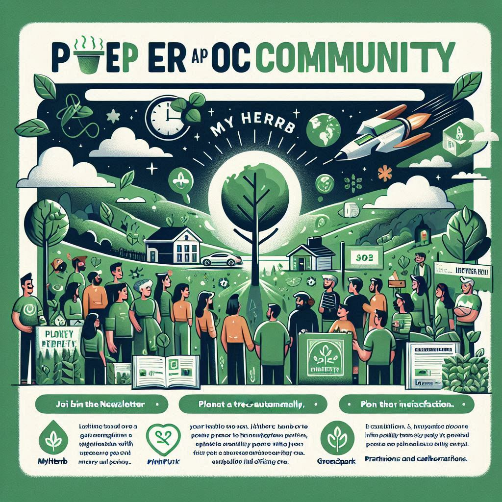
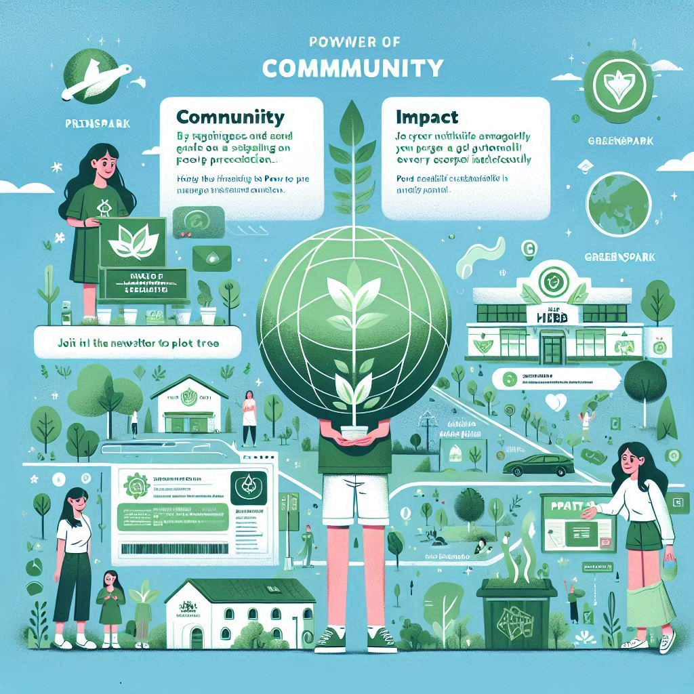
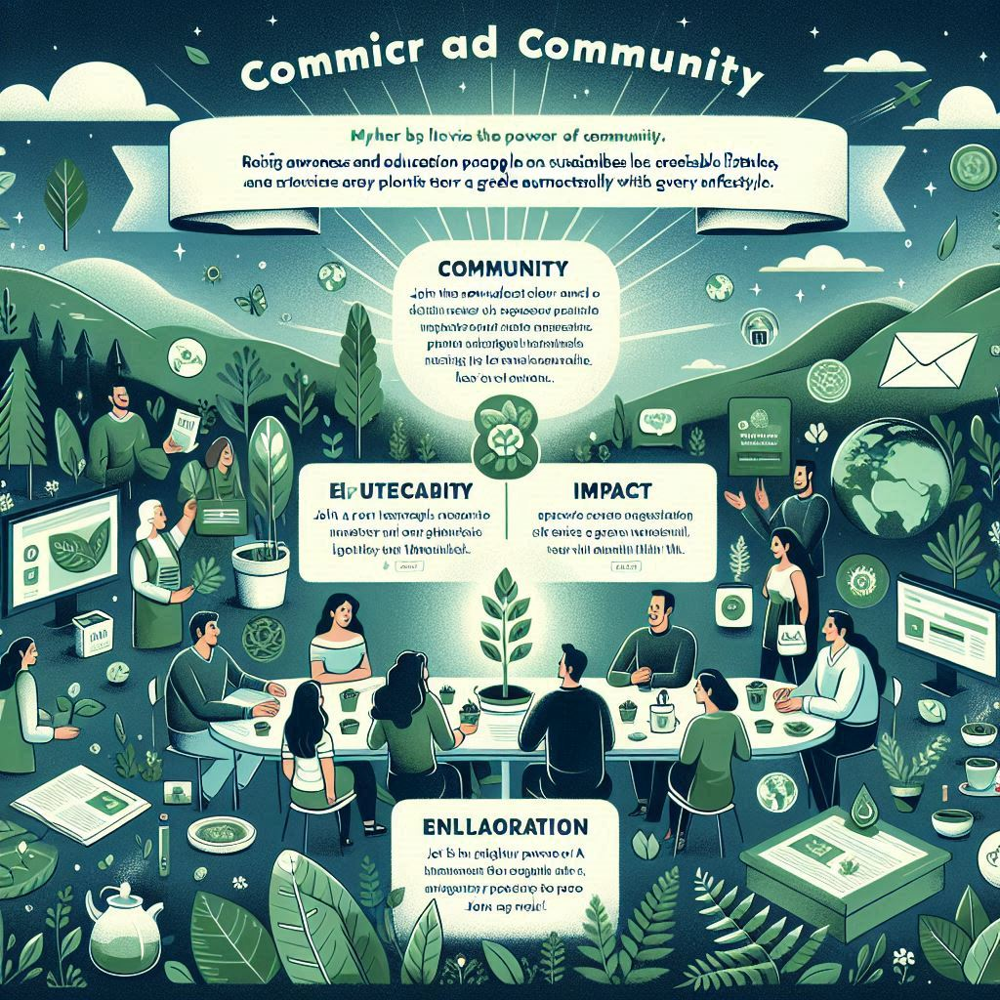
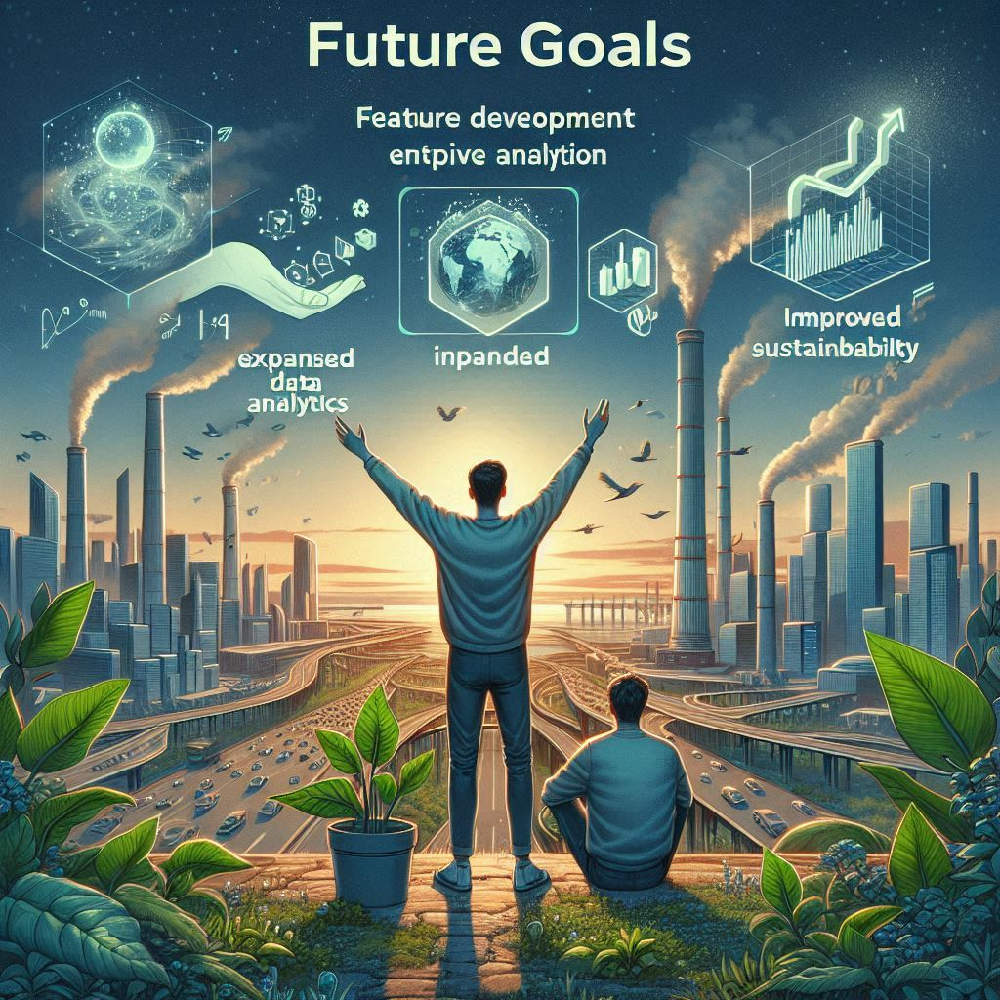
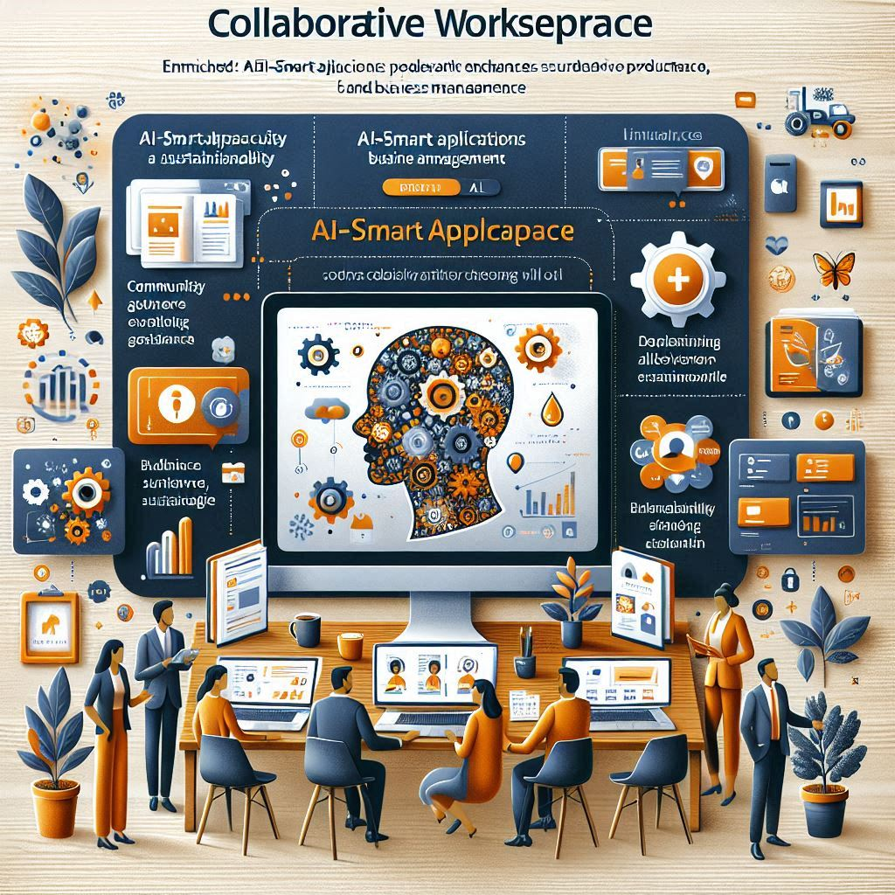
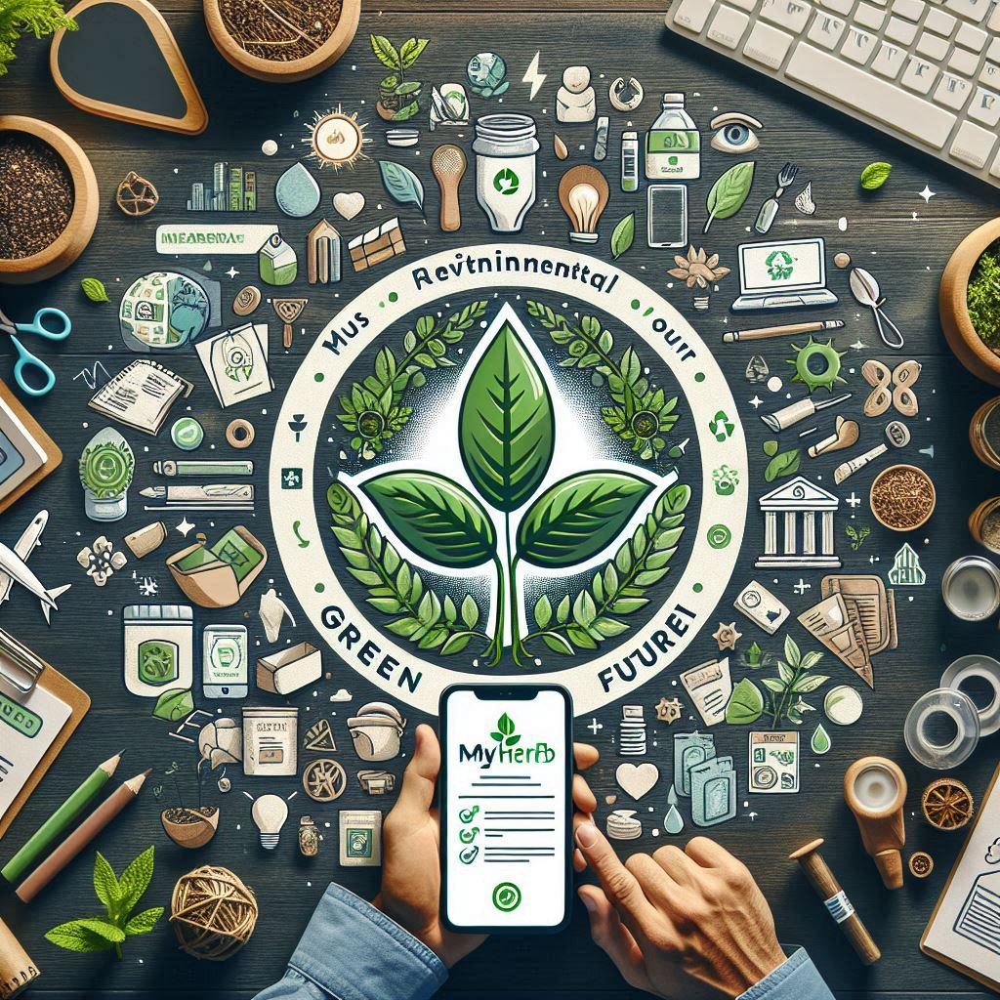

# PrintLess Eco MetriX (Beta v0.13)

<figure><figcaption></figcaption></figure>

## Overview

This tool provides comprehensive metrics to promote sustainability, reduce waste, and enhance our connection with nature. It is designed for individuals and businesses looking to actively reduce their environmental footprint while maximizing their impact on sustainability.

## Features

### Sustainability Metrics

* Track consumption patterns and understand their environmental impact with detailed analytics.
* Monitor key sustainability indicators such as carbon footprint, water usage, and energy consumption.

### Waste Reduction

* Identify areas where waste can be minimized, from packaging to paper usage.
* Implement strategies to reduce waste and improve resource efficiency.

### Eco-Friendly Goals

* Set and achieve ambitious sustainability goals with personalized recommendations.
* Track progress toward these goals in real-time.

### User-Friendly Interface

* Navigate through a seamless and intuitive platform designed for ease of use.
* Access all features and data through a clean and organized dashboard.

### Real-Time Data

* Access up-to-date information to make informed decisions for a healthier environment.
* Receive alerts and notifications about your sustainability performance.

<figure><figcaption></figcaption></figure>

## Benefits

* **Reduce Carbon Footprint**: Lower carbon emissions through more competent resource management.
* **Save Resources**: Conserve water and energy, contributing to a greener planet.
* **Enhance Sustainability**: Align practices with global sustainability standards and showcase commitment to eco-friendly initiatives.

## Getting Started

### Prerequisites

* Ensure you have internet access on a device that is compatible with your device.
* Create an account on the myHerb.co.il platform.

### Installation

1. Download the PrintLess Eco Metrics application from the official website or app store.
2. Follow the installation instructions provided in the setup guide.

### Usage

* Log in to your account and navigate to the PrintLess Eco Metrics dashboard.
* Explore the various features and start tracking your sustainability metrics.
* Set your eco-friendly goals and monitor your progre

<figure><figcaption></figcaption></figure>

 

<figure><figcaption></figcaption></figure>

 

<figure><figcaption></figcaption></figure>

 

<figure><figcaption></figcaption></figure>

 

<figure><figcaption></figcaption></figure>

 

<figure><figcaption></figcaption></figure>

 

<figure><figcaption></figcaption></figure>

 

<figure><figcaption></figcaption></figure>

 

<figure><figcaption></figcaption></figure>

 

<figure><figcaption></figcaption></figure>

 

<figure><figcaption></figcaption></figure>

 

<figure><figcaption></figcaption></figure>

 

<figure><figcaption></figcaption></figure>

 

<figure><figcaption></figcaption></figure>

 

<figure><figcaption></figcaption></figure>

 

<figure><figcaption></figcaption></figure>

 

<figure><figcaption></figcaption></figure>

 

<figure><figcaption></figcaption></figure>

 

<figure><figcaption></figcaption></figure>

 

<figure><figcaption></figcaption></figure>

 

<figure><figcaption></figcaption></figure>

 

<figure><figcaption></figcaption></figure>

 

<figure><figcaption></figcaption></figure>

 

<figure><figcaption></figcaption></figure>

 

<figure><figcaption></figcaption></figure>

 

<figure><figcaption></figcaption></figure>

 

<figure><figcaption></figcaption></figure>

 

<figure><figcaption></figcaption></figure>

 

<figure><figcaption></figcaption></figure>

 

<figure><figcaption></figcaption></figure>

 

<figure><figcaption></figcaption></figure>

 

<figure><figcaption></figcaption></figure>

 

<figure><figcaption></figcaption></figure>

 

<figure><figcaption></figcaption></figure>

 

<figure><figcaption></figcaption></figure>

 

<figure><figcaption></figcaption></figure>

 

<figure><figcaption></figcaption></figure>

 

<figure><figcaption></figcaption></figure>

 

<figure><figcaption></figcaption></figure>

 

<figure><figcaption></figcaption></figure>

 

<figure><figcaption></figcaption></figure>

 

<figure><figcaption></figcaption></figure>

 

<figure><figcaption></figcaption></figure>

 

<figure><figcaption></figcaption></figure>

 

<figure><figcaption></figcaption></figure>

 

<figure><figcaption></figcaption></figure>

 

<figure><figcaption></figcaption></figure>

 

<figure><figcaption></figcaption></figure>

 

<figure><figcaption></figcaption></figure>

 

<figure><figcaption></figcaption></figure>

 

<figure><figcaption></figcaption></figure>

 

<figure><figcaption></figcaption></figure>

 

<figure><figcaption></figcaption></figure>

 

<figure><figcaption></figcaption></figure>

 

<figure><figcaption></figcaption></figure>

 

<figure><figcaption></figcaption></figure>

 

<figure><figcaption></figcaption></figure>

 

<figure><figcaption></figcaption></figure>

 

<figure><figcaption></figcaption></figure>

 

<figure><figcaption></figcaption></figure>

 

<figure><figcaption></figcaption></figure>

 

<figure><figcaption></figcaption></figure>

 

<figure><figcaption></figcaption></figure>

 

<figure><figcaption></figcaption></figure>

 

<figure><figcaption></figcaption></figure>

 

<figure><figcaption></figcaption></figure>

 

<figure><figcaption></figcaption></figure>

 

<figure><figcaption></figcaption></figure>

 

<figure><figcaption></figcaption></figure>

### Contributing

We welcome contributions from the community to enhance the PrintLess Eco Metrics application. To contribute, please follow these steps:

1. Fork the repository.
2. Create a new branch (`git checkout -b feature-branch`).
3. Make your changes and commit them (`git commit -m 'Add new feature'`).
4. Push to the branch (`git push origin feature-branch`).
5. Open a pull request and describe your changes.

## Troubleshooting

### Common Issues and Solutions

1. **Unable to Log In**
   * **Solution**: Ensure your internet connection is stable. Double-check your username and password. If you’ve forgotten your password, reset it using the “Forgot Password” feature.
2. **App Crashes or Freezes**
   * **Solution**: Restart the application. If the issue persists, try reinstalling the app. Ensure your device meets the minimum system requirements.
3. **Data Not Syncing**
   * **Solution**: Check your internet connection. Ensure that the app has the necessary permissions to access the internet. Try refreshing the data or logging out and back in.
4. **Metrics Not Updating**
   * **Solution**: Ensure that your device’s date and time settings are correct. Check for any pending app updates and install them. Restart the app to see if the issue is resolved.
5. **Error Messages**
   * **Solution**: Note the error message and refer to the app’s help section or FAQs for specific guidance. If the problem persists, contact support.

#### Contact Support

If you encounter any issues not listed here, don't hesitate to contact our support team at support@myherb.co.il. To help us assist you more effectively, provide a detailed description of the problem, including any error messages.

### Contributing

We welcome contributions from the community to enhance the PrintLess Eco Metrics application. To contribute, please follow these steps:

1. Fork the repository.
2. Create a new branch (`git checkout -b feature-branch`).
3. Make your changes and commit them (`git commit -m 'Add new feature'`).
4. Push to the branch (`git push origin feature-branch`).
5. Open a pull request and describe your changes.

### License

This project is licensed under the MIT License - see the LICENSE file for details.

#### Contact

For any questions or support, please get in touch with us at support@myherb.co.il.

***

Feel free to customize this documentation further to fit your specific needs and any additional features or details you want to include.
