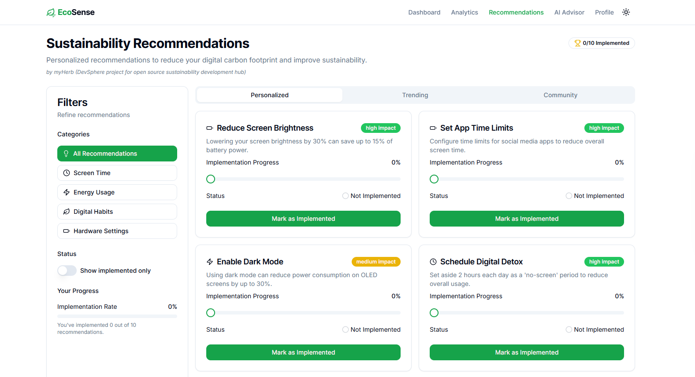

# EcoSense EcoSense v3.3 BETA Documentation

Whether you’re an individual user looking to lower your digital carbon footprint or a developer eager to integrate sustainability into your projects, this documentation is your guide to understanding, using, and evolving [EcoSense](https://ecosense.myherb.co.il).

<figure><figcaption></figcaption></figure>

***

## 1. Introduction

#### Overview

[**EcoSense v3.3 BETA**](https://ecosense.myherb.co.il) is a powerful tool that monitors device usage and energy consumption in real time. Designed with sustainability in mind, [EcoSense](https://ecosense.myherb.co.il) helps you track your digital “eco footprint” offering AI-driven insights, personalized recommendations, and interactive data visualizations. Developed as part of the [DevSphere](https://sphere.myherb.co.il/) initiative, this preview release invites early adopters to shape its final form with their feedback.

<figure><figcaption></figcaption></figure>

### Purpose & Vision

* **Sustainability Focus:** Encourage new digital behaviors to reduce energy consumption.
* **Personalized Insights:** Provide actionable feedback based on individual usage patterns.
* **Community-Driven Development:** Involve the eco-conscious community in a collaborative improvement process.

## Audience

### [EcoSense](https://ecosense.myherb.co.il) is designed for:

* **Eco-conscious Users:** Individuals committed to reducing their digital impact.
* **Tech Enthusiasts:** Users curious about energy metrics and data trends.
* **Digital Sustainability Advocates:** Professionals and hobbyists who want to integrate sustainable habits into their online and offline lifestyles.

<figure><figcaption></figcaption></figure>

***

## 2. Getting Started

#### Installation Guide

**System Requirements**

* **Operating System:** Windows 10 or later, macOS 11+, or modern Linux distributions.
* **Browser:** Latest versions of Chrome, Firefox, Edge, or Safari.
* **Hardware:** Modern CPU, at least 4 GB of RAM; stable Internet connection required.
* **Connectivity:** Wi-Fi, Bluetooth, or other supported protocols for sensor data collection.

<figure><figcaption></figcaption></figure>

### **Installation Steps**

1. **Download the Installer:** Visit the [myHerb](https://myherb.co.il) website to download the latest [EcoSense](https://ecosense.myherb.co.il) installer.
2. **Run the Installer:** Follow on-screen instructions to install the application on your device.
3. **Grant Permissions:** Allow required permissions for device data collection, smart sensor connectivity, and notifications.

### Initial Setup

**Account Creation & Device Connection**

* **Account Setup:** Create an account using your email address or sign in with existing myHerb credentials.
* **Connecting Devices:**
  * Add your digital devices (PCs, smartphones, IoT sensors) to the system.
  * Follow the guided wizard to establish sensor connectivity and verify network settings.

<figure><figcaption></figcaption></figure>

## **Dashboard Calibration**

* Walk through the calibration process where the system gathers sample data.
* Configure how data is aggregated on your dashboard: choose the metrics to display and set up preferred visualization modes.

### Quick Start Tutorial

* **Interactive Tour:**\
  Get an overview of the main dashboard, its metrics, and interactive visualizations.
* **Demo Mode:**\
  Use sample data to see how your digital footprint is calculated.
* **Eco-Goal Setup:**\
  Set an initial sustainability challenge based on your baseline data.

***

## 3. Core Features

#### Real-Time Eco Dashboard

* **Dynamic Metrics:**\
  Displays real-time data on device usage, screen time, and energy consumption (kilowatt-hours).
* **Interactive Visualizations:**\
  Dashboards update dynamically with charts and graphs that let you track trends and pinpoint usage spikes.
* **Customizable Interface:**\
  Easily configure the dashboard to show data by device, time period, or application category.

<figure><figcaption></figcaption></figure>

### AI-Driven Insights & Recommendations

* **Behavior Analysis:**\
  Advanced machine learning algorithms process your data, detect patterns, and pinpoint energy-intensive habits.
* **Personalized Suggestions:**\
  Get tailored recommendations such as lowering brightness during peak hours, limiting heavy-usage sessions, or automating power settings.
* **Continuous Improvement:**\
  The AI evolves with your behavior, refining suggestions over time to ensure they always fit your lifestyle.

### Usage Comparison & Benchmarking

* **Community Benchmarks:**\
  Compare your metrics against aggregated data from similar users.
* **Performance Insights:**\
  Identify strengths and areas for improvement by reviewing historical trends.
* **Rankings & Feedback:**\
  Friendly leaderboards foster a competitive environment that motivates sustainable habits.

### Sustainability Challenges & Gamification

* **Eco-Challenges:**\
  Participate in periodic challenges—such as reducing screen time or lowering energy consumption—to earn badges and virtual rewards.
* **Engaging Rewards System:**\
  Unlock achievements and earn points that can be shared with your community.
* **Leaderboards:**\
  See where you rank among peers, sparking further motivation for continual improvement.

### Environmental Impact Forecasting

* **Predictive Analysis:**\
  The forecasting module uses current metrics to model future energy consumption.
* **Scenario Planning:**\
  Explore “what if” scenarios that show how small behavior changes can lead to substantial impacts over time.
* **Goal Setting:**\
  Define realistic, long-term sustainability targets based on forecasted data.

### Customizable Alerts & Notifications

* **Real-Time Notifications:**\
  Set up alerts triggered by metrics crossing predefined thresholds.
* **Personalized Alerts:**\
  Customize notification frequency, style, and data thresholds for a fully tailored experience.
* **Dashboard Feedback:**\
  Immediate, on-screen notifications prompt timely adjustments when necessary.

## Community-Driven Innovation

* **User Feedback Loop:**\
  Beta participants can submit bug reports and suggestions directly via the app.
* **Engaged Forums:**\
  Join user forums and discussion boards to share experiences and ideas.
* **Influence the Roadmap:**\
  User input and community votes help prioritize upcoming features and improvements.

***

## 4. User Guide & Best Practices

#### Navigating the Interface

* **Dashboard Overview:**\
  Detailed walkthrough of all dashboard sections, including real-time graphs, settings icons, and navigation menus.
* **Menu Structure:**\
  Explanation of the main menu, forms, and alert icons for quick access to various features.
* **Shortcuts & Tips:**\
  Learn keyboard shortcuts and hidden functionalities that enhance navigation.

### Data Interpretation

* **Graph & Chart Insights:**\
  In-depth explanation of the visual data representations (bar charts, trend lines, pie charts) and how to interpret them.
* **Metric Definitions:**\
  Understand what each metric means (screen time vs. energy consumption vs. eco-rating) and why it is important.
* **Trend Analysis:**\
  Learn how to monitor peak usage periods, seasonal changes, and other trends that help you adjust your behaviors.

### Personalization Tips

* **Customizing the Dashboard:**\
  Guides on rearranging widgets, setting preferred color schemes, and configuring detailed views.
* **Setting Personal Goals:**\
  Step-by-step advice on setting realistic sustainability targets and tracking progress toward them.
* **Third-Party Integrations:**\
  How to sync [EcoSense](https://ecosense.myherb.co.il) with other tools and smart apps for a seamless data experience.

### Additional Sustainability Strategies

* **Digital Minimalism:**\
  Tips on reducing digital clutter and unnecessary app usage to save energy.
* **Energy Management:**\
  Best practices for managing device settings and power consumption.
* **Eco-Friendly Practices:**\
  Complementary strategies such as using energy-efficient hardware and green cloud computing services.

***

## 5. Beta Participation & Feedback

#### How to Provide Feedback

* **In-App Feedback Portal:**\
  Easily report bugs, suggest enhancements, and share your overall experience.
* **Detailed Templates:**\
  Use our structured feedback forms to ensure your reports include all the necessary details.
* **Periodic Surveys:**\
  Participate in short surveys designed to capture user satisfaction and suggestions for new features.

### Community Involvement

* **User Forums and Chat Rooms:**\
  Join discussion boards where beta users exchange ideas and troubleshooting tips.
* **Beta User Groups:**\
  Participate in exclusive webinars, live Q\&A sessions, and beta demo events.
* **Social Media Integration:**\
  Engage with the development team and the broader community through our official social channels and GitHub repository.

### Roadmap & Future Updates

* **Transparent Roadmap:**\
  Keep up-to-date with our public roadmap, which details planned features, improvements, and bug fixes.
* **Release Notes:**\
  Access detailed notes about each release, including changes, performance enhancements, and known issues.
* **Community Votes:**\
  Participate in voting on new features and improvements to shape future development.

***

## 6. Troubleshooting & FAQ

#### Common Issues

**Connectivity & Sensor Integration Issues**

| **Issue**                  | **Symptoms**                          | **Possible Causes**                         | **Resolutions**                                                                              |
| -------------------------- | ------------------------------------- | ------------------------------------------- | -------------------------------------------------------------------------------------------- |
| **No Data Displayed**      | Dashboard shows “No Data” or blank UI | Sensor not connected; network interruptions | Ensure devices are within range, restart sensors/app, and verify your network settings.      |
| **Intermittent Data Loss** | Periodic drop in metrics displayed    | Weak signal strength or sensor power issues | Check battery levels, adjust sensor placement, and ensure a steady network connection.       |
| **Delayed Data Sync**      | Data appears with a significant delay | Network congestion or heavy server load     | Restart your router, check for network interference, and close bandwidth-heavy applications. |

### **Dashboard & Visualization Problems**

* **Slow Response:**
  * Ensure no unnecessary background applications are draining system resources.
  * Clear your browser or app cache.
  * Verify your device meets the minimum hardware requirements.
* **Graphical Anomalies:**
  * Manually refresh the dashboard.
  * Compare the graphs with historical logs to check for temporary glitches.
  * Report recurring issues through the in-app feedback system along with screenshots and error logs.

### **AI Insights & Notifications Failures**

* **Missing Recommendations:**
  * Confirm that sensors are properly connected and data collection is active.
  * Check network connections to ensure continuous data transmission.
  * Restart the application and review error logs if the problem persists.
* **Notification Alerts Not Triggering:**
  * Verify that notifications are enabled and that thresholds are correctly defined in the settings.
  * Test the alert system using the “Alert Test” function in the preferences menu.

### Frequently Asked Questions (FAQ)

* **What is** [**EcoSense**](https://ecosense.myherb.co.il)**?**\
  [EcoSense](https://ecosense.myherb.co.il) is a digital tool designed to monitor and analyze device usage to help you reduce your digital environmental impact.
* **How does** [**EcoSense**](https://ecosense.myherb.co.il) **measure energy consumption?**\
  Data is gathered in real time from connected devices and sensors, processed using advanced algorithms, and displayed through interactive dashboards.
* **I’m having issues with data sync; what should I do?**\
  Check your network, verify that all sensors are online, and use the manual sync option from the settings page.

## Support & Contact Information

* **Technical Support:**\
  Reach out to our support team via the in-app help center or email us at [support@myherb.com](mailto:support@myherb.com).
* **Knowledge Base:**\
  Visit our online resource center for additional guides and troubleshooting articles.
* **Community Forums:**\
  Engage with other users and developers for peer support and advice.

***

### 7. Developer & Integration Resources

#### API Documentation

* **Overview:**\
  Our public API allows you to retrieve [EcoSense](https://ecosense.myherb.co.il) metrics, manage device integrations, and customize dashboard views.
* **Authentication & Endpoints:**\
  Detailed instructions on setting up API keys, making RESTful calls, and integrating data into your own applications.
* **Sample Code:**\
  Example code snippets in Python, JavaScript, and other languages to help kickstart your integration process.
* **Integration Use Cases:**\
  Real-world examples of integrating [EcoSense](https://ecosense.myherb.co.il) data into smart home systems, third-party dashboards, and energy management tools.

### Customization & Extensibility Guides

* **Plugin Architecture:**\
  Documentation on how to develop plugins that extend the functionality of [EcoSense](https://ecosense.myherb.co.il), including API hooks and coding standards.
* **Contributing Guidelines:**\
  Clear instructions on setting up the local development environment, testing your changes, and submitting pull requests.
* **Third-Party Integrations:**\
  Step-by-step guides for connecting [EcoSense](https://ecosense.myherb.co.il) with various smart home devices, energy monitors, and external data sources.

### Technical Deep Dive

* **System Architecture:**\
  Detailed diagrams and descriptions of the multi-tier system, including sensor integration, data aggregation, machine learning modules, and dashboard presentation.
* **Configuration Settings:**\
  Advanced configuration options for customizing data refresh rates, alert thresholds, and user interface parameters.
* **Security & Privacy:**\
  Information covering encryption methods, data anonymization techniques, and compliance with modern data privacy regulations.

***

## 8. Appendices

#### Glossary

* **Digital Footprint:** The total digital activity of a user that contributes to energy consumption.
* **Eco-Rating:** A score representing the efficiency of your digital usage habits.
* **Benchmarking:** Comparing one’s own metrics against community standards.
* **Predictive Modeling:** Algorithms that forecast future energy consumption based on current data.

## Change Log / Release Notes

* **Version History:**\
  A chronological log of all changes, bug fixes, and feature iterations from previous versions up to v3.3 BETA.
* **Release Summaries:**\
  Summaries for each version detailing enhancements, performance improvements, and known issues.

## Legal & Licensing Information

* **Copyright:**\
  All rights reserved by myHerb.
* **Usage Terms:**\
  Detailed terms of use, limitations, and licensing agreements governing [EcoSense](https://ecosense.myherb.co.il).
* **Open-Source Licenses:**\
  Information on the open-source components used in [EcoSense](https://ecosense.myherb.co.il) and guidelines for contributors.

## Additional Resources & References

* **Further Reading:**\
  External articles, research papers, and case studies on digital sustainability.
* **Sustainability Organizations:**\
  Links to environmental organizations and communities committed to green technology.
* **Tutorials & Webinars:**\
  Archive of webinars, tutorials, and live demo sessions discussing best practices in sustainable digital technology.

***

### Appendix A: Detailed Data Flow Diagrams

Understanding how [EcoSense](https://ecosense.myherb.co.il) processes data is crucial. Below are two detailed diagrams illustrating the end-to-end data flows.

#### 1. Overall[ EcoSense](https://ecosense.myherb.co.il) Data Flow

```
           +----------------------------+
           |   Digital Devices & IoT    |
           | (PCs, Smartphones, Sensors)|
           +-------------+--------------+
                         │
                         ▼
           +----------------------------+
           |  Device Integration Layer  |
           | (Connectivity Protocols)   |
           +-------------+--------------+
                         │
                         ▼
           +----------------------------+
           | Data Aggregation &         |
           | Normalization Engine       |
           +-------------+--------------+
                         │
                         ▼
           +----------------------------+
           | Real-Time Eco Dashboard    |
           | (Interactive Visuals)      |
           +-------------+--------------+
                         │
            +------------+-------------+
            │                          │
            ▼                          ▼
+----------------------+   +------------------------------+
| AI-Driven Insights   |   | Cloud Data Storage &         |
| & Recommendations    |   | Historical Analytics         |
+------------+---------+   +---------------+--------------+
             │                             │
             └-------------┬---------------┘
                           │
                           ▼
            +----------------------------+
            | User Feedback & Community  |
            | Input (Beta Participation) |
            +----------------------------+
```

**Explanation:**\
Data is collected from your devices and converted to a standardized format, then aggregated and processed in real time. Processed data supports both immediate visualization on your dashboard and deep analysis via our AI engines, with community feedback forming a continuous improvement loop.

## 2. Sensor-to-Cloud Data Flow

```
         [Smart Sensors/Devices]
                   │
            (Data Capture)
                   │
                   ▼
   [Local Data Buffering Module]
                   │
      (Pre-Processing & Validation)
                   │
                   ▼
    [Secure Transmission Module]
        (Encryption & API Calls)
                   │
                   ▼
    [Data Aggregation Server]
           ┌——————┬——————┬——————┐
           │      │      │      │
           ▼      ▼      ▼      ▼
 [Real-time Analytics] [Historical Storage] [Machine Learning]
           │      │      │      │
           └——————┴——————┴——————┘
                   │
                   ▼
       [EcoSense Dashboard & Insights]
```

**Explanation:**\
Sensor data is initially buffered and validated locally before being encrypted and securely transmitted. The aggregation server then processes data for real-time analytics as well as for storage and machine learning, culminating in actionable insights presented on the dashboard.

***

## Appendix B: Extended Troubleshooting Tips

#### 1. Connectivity & Sensor Integration Issues

| **Issue**                  | **Symptoms**                    | **Possible Causes**                              | **Resolutions**                                                                       |
| -------------------------- | ------------------------------- | ------------------------------------------------ | ------------------------------------------------------------------------------------- |
| **No Data Displayed**      | Blank UI or “No Data” message   | Sensors disconnected or network issues           | Verify network connection, bring sensors into range, restart sensors and app.         |
| **Intermittent Data Loss** | Periodic missing data           | Weak signal, source interference, battery issues | Check battery levels, reposition sensors, use a network repeater if necessary.        |
| **Delayed Data Sync**      | Significant lag in data updates | Network congestion or server overload            | Restart router, switch channels, close other high-bandwidth applications, then retry. |

### 2. Dashboard & Visualization Problems

* **Slow Response Time:**
  * Close unnecessary applications.
  * Clear browser/app cache.
  * Ensure hardware meets requirements.
* **Graph Inaccuracies:**
  * Use the manual refresh option.
  * Compare with historical logs to confirm if the issue persists.
  * Submit a bug report with screenshots and a detailed description.

#### 3. AI Insights & Notification Failures

* **Missing Insights:**
  * Confirm sensor data is actively received.
  * Check network stability.
  * Restart the app and check logs in the settings.
* **Alerts Not Triggering:**
  * Verify alert threshold settings.
  * Check device notification permissions in your operating system.
  * Use the “Alert Test” feature to confirm correct behavior.

### Additional Steps

* **Log Export:**\
  Use the integrated log export feature to send detailed logs to support.
* **Manual Sync:**\
  Trigger a manual data refresh via settings when discrepancies are detected.
* **Contact Support:**\
  Provide detailed error logs and screenshots when contacting our technical support team.

***

### Appendix C: Best Practices for Engaging with the Developer Community

#### 1. Establish Clear Communication Channels

* **Community Forums & Chat:**\
  Set up and regularly monitor discussion boards, a Slack or Discord channel, and schedule monthly Q\&A sessions with core developers.
* **Regular Webinars & AMAs:**\
  Organize online events such as “Ask Me Anything” sessions and webinars to discuss new features and gather community input.

## 2. Define Contribution Guidelines

* **Clear Documentation:**\
  Provide a detailed “Contributing.md” guide that explains coding standards, pull request guidelines, and testing protocols.
* **Issue Tracking:**\
  Encourage users to log bugs and feature requests on a centralized issue tracker, linking these reports to your public roadmap.
* **Feature Voting:**\
  Let developers vote on new features, ensuring community demands help prioritize enhancements.

### 3. Recognize and Reward Contributions

* **Acknowledgment Programs:**\
  Recognize commitment by highlighting top contributors on the project’s website and newsletters.
* **Incentives:**\
  Offer perks such as exclusive beta access, early feature previews, and opportunities to co-author technical blog posts.

### 4. Foster an Inclusive and Sustainable Culture

* **Inclusivity in Communication:**\
  Ensure all community interactions are respectful and welcoming to new and experienced developers alike.
* **Educational Resources:**\
  Provide tutorials, workshops, and case studies focused on sustainable coding practices.
* **Iterative Community Engagement:**\
  Constantly seek community feedback through periodic surveys and adjust best practices as needed.


Try [EcoSence](https://ecosense.myherb.co.il) by myHerb




