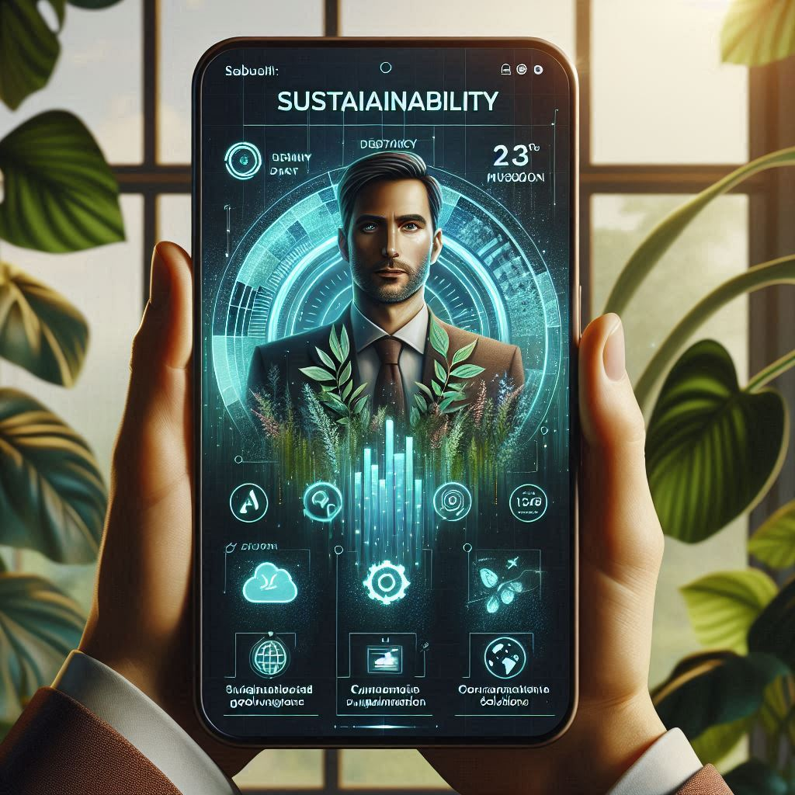
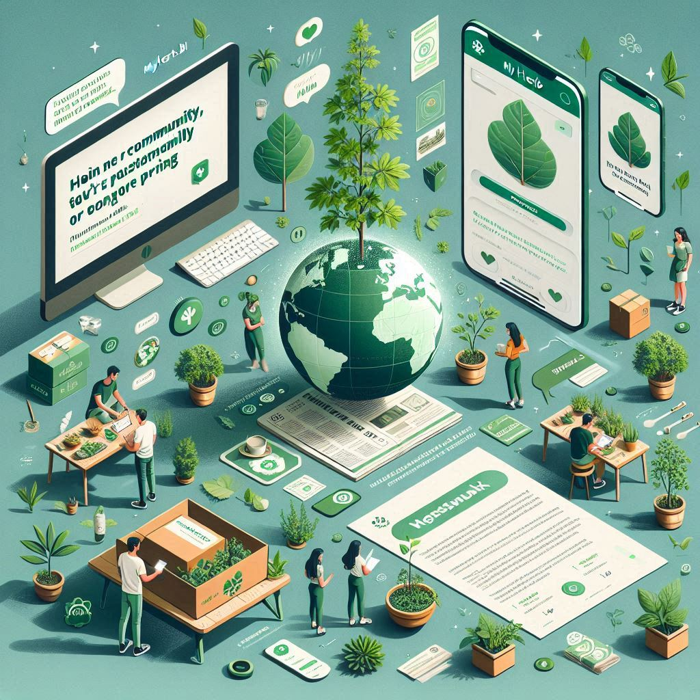
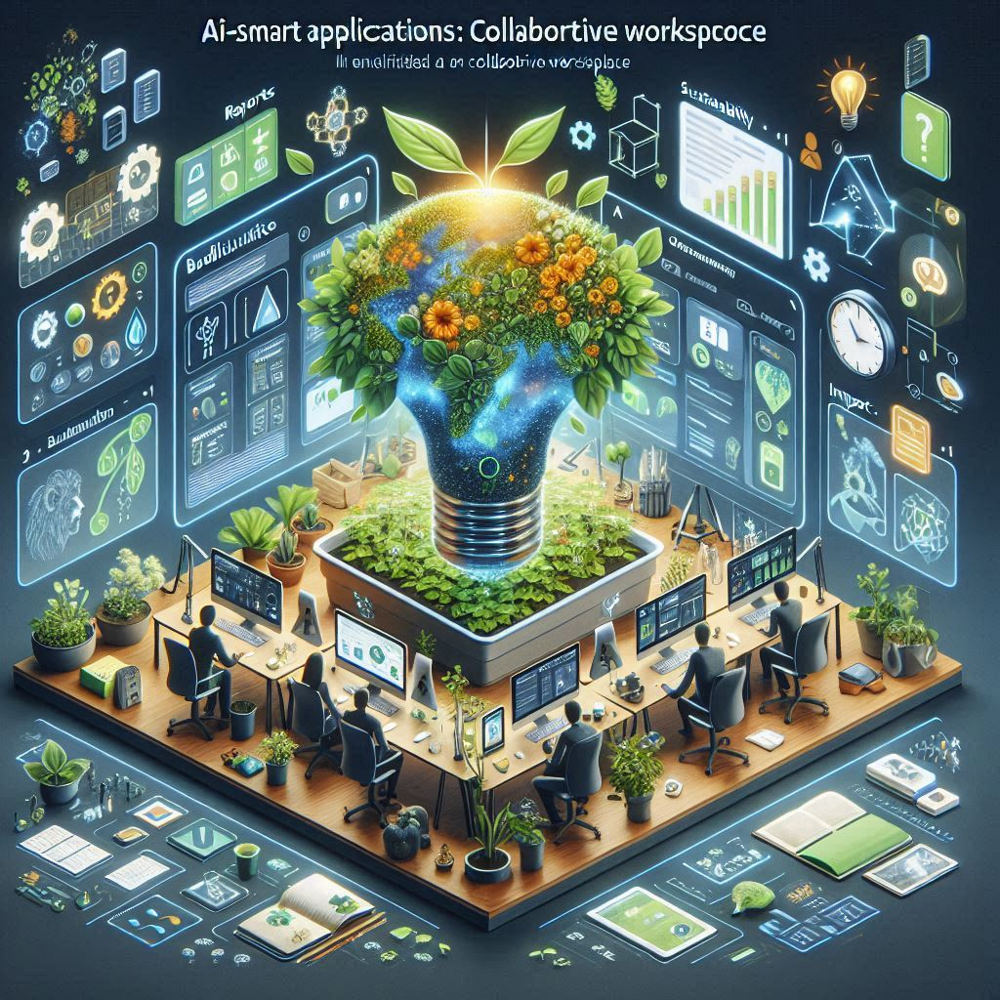

# PrintLess EcoMetrics (Update Beta v0.13)

<figure><figcaption></figcaption></figure>

## Overview

This tool provides comprehensive metrics to promote sustainability, reduce waste, and enhance our connection with nature. It is designed for individuals and businesses looking to actively reduce their environmental footprint while maximizing their impact on sustainability.

## Features

### Sustainability Metrics

* Track consumption patterns and understand their environmental impact with detailed analytics.
* Monitor key sustainability indicators such as carbon footprint, water usage, and energy consumption.

### Waste Reduction

* Identify areas where waste can be minimized, from packaging to paper usage.
* Implement strategies to reduce waste and improve resource efficiency.

### Eco-Friendly Goals

* Set and achieve ambitious sustainability goals with personalized recommendations.
* Track progress toward these goals in real-time.

### User-Friendly Interface

* Navigate through a seamless and intuitive platform designed for ease of use.
* Access all features and data through a clean and organized dashboard.

### Real-Time Data

* Access up-to-date information to make informed decisions for a healthier environment.
* Receive alerts and notifications about your sustainability performance.

<figure><figcaption></figcaption></figure>

## Benefits

* **Reduce Carbon Footprint**: Lower carbon emissions through more competent resource management.
* **Save Resources**: Conserve water and energy, contributing to a greener planet.
* **Enhance Sustainability**: Align practices with global sustainability standards and showcase commitment to eco-friendly initiatives.

## Getting Started

### Prerequisites

* Ensure you have internet access on a device that is compatible with your device.
* Create an account on the myHerb.co.il platform.

### Installation

1. Download the PrintLess Eco Metrics application from the official website or app store.
2. Follow the installation instructions provided in the setup guide.

### Usage

* Log in to your account and navigate to the PrintLess Eco Metrics dashboard.
* Explore the various features and start tracking your sustainability metrics.
* Set your eco-friendly goals and monitor your progre

<div><figure><figcaption></figcaption></figure> <figure><figcaption></figcaption></figure> <figure><figcaption></figcaption></figure> <figure><figcaption></figcaption></figure> <figure><figcaption></figcaption></figure> <figure><figcaption></figcaption></figure> <figure><figcaption></figcaption></figure> <figure><figcaption></figcaption></figure> <figure><figcaption></figcaption></figure> <figure><figcaption></figcaption></figure> <figure><figcaption></figcaption></figure> <figure><figcaption></figcaption></figure> <figure><figcaption></figcaption></figure> <figure><figcaption></figcaption></figure> <figure><figcaption></figcaption></figure> <figure><figcaption></figcaption></figure> <figure><figcaption></figcaption></figure> <figure><figcaption></figcaption></figure> <figure><figcaption></figcaption></figure> <figure><figcaption></figcaption></figure> <figure><figcaption></figcaption></figure> <figure><figcaption></figcaption></figure> <figure><figcaption></figcaption></figure> <figure><figcaption></figcaption></figure> <figure><figcaption></figcaption></figure> <figure><figcaption></figcaption></figure> <figure><figcaption></figcaption></figure> <figure><figcaption></figcaption></figure> <figure><figcaption></figcaption></figure> <figure><figcaption></figcaption></figure> <figure><figcaption></figcaption></figure> <figure><figcaption></figcaption></figure> <figure><figcaption></figcaption></figure> <figure><figcaption></figcaption></figure> <figure><figcaption></figcaption></figure> <figure><figcaption></figcaption></figure> <figure><figcaption></figcaption></figure> <figure><figcaption></figcaption></figure> <figure><figcaption></figcaption></figure> <figure><figcaption></figcaption></figure> <figure><figcaption></figcaption></figure> <figure><figcaption></figcaption></figure> <figure><figcaption></figcaption></figure> <figure><figcaption></figcaption></figure> <figure><figcaption></figcaption></figure> <figure><figcaption></figcaption></figure> <figure><figcaption></figcaption></figure> <figure><figcaption></figcaption></figure> <figure><figcaption></figcaption></figure> <figure><figcaption></figcaption></figure> <figure><figcaption></figcaption></figure> <figure><figcaption></figcaption></figure> <figure><figcaption></figcaption></figure> <figure><figcaption></figcaption></figure> <figure><figcaption></figcaption></figure> <figure><figcaption></figcaption></figure> <figure><figcaption></figcaption></figure> <figure><figcaption></figcaption></figure> <figure><figcaption></figcaption></figure> <figure><figcaption></figcaption></figure> <figure><figcaption></figcaption></figure> <figure><figcaption></figcaption></figure> <figure><figcaption></figcaption></figure> <figure><figcaption></figcaption></figure> <figure><figcaption></figcaption></figure> <figure><figcaption></figcaption></figure> <figure><figcaption></figcaption></figure> <figure><figcaption></figcaption></figure> <figure><figcaption></figcaption></figure></div>

### Contributing

We welcome contributions from the community to enhance the PrintLess Eco Metrics application. To contribute, please follow these steps:

1. Fork the repository.
2. Create a new branch (`git checkout -b feature-branch`).
3. Make your changes and commit them (`git commit -m 'Add new feature'`).
4. Push to the branch (`git push origin feature-branch`).
5. Open a pull request and describe your changes.

## Troubleshooting

### Common Issues and Solutions

1. **Unable to Log In**
   * **Solution**: Ensure your internet connection is stable. Double-check your username and password. If you’ve forgotten your password, reset it using the “Forgot Password” feature.
2. **App Crashes or Freezes**
   * **Solution**: Restart the application. If the issue persists, try reinstalling the app. Ensure your device meets the minimum system requirements.
3. **Data Not Syncing**
   * **Solution**: Check your internet connection. Ensure that the app has the necessary permissions to access the internet. Try refreshing the data or logging out and back in.
4. **Metrics Not Updating**
   * **Solution**: Ensure that your device’s date and time settings are correct. Check for any pending app updates and install them. Restart the app to see if the issue is resolved.
5. **Error Messages**
   * **Solution**: Note the error message and refer to the app’s help section or FAQs for specific guidance. If the problem persists, contact support.

#### Contact Support

If you encounter any issues not listed here, don't hesitate to contact our support team at support@myherb.co.il. To help us assist you more effectively, provide a detailed description of the problem, including any error messages.

### Contributing

We welcome contributions from the community to enhance the PrintLess Eco Metrics application. To contribute, please follow these steps:

1. Fork the repository.
2. Create a new branch (`git checkout -b feature-branch`).
3. Make your changes and commit them (`git commit -m 'Add new feature'`).
4. Push to the branch (`git push origin feature-branch`).
5. Open a pull request and describe your changes.

```
'use client'

import { useState, useEffect } from 'react'
import { Card, CardContent, CardFooter, CardHeader, CardTitle, CardDescription } from "@/components/ui/card"
import { Label } from "@/components/ui/label"
import { Slider } from "@/components/ui/slider"
import { Input } from "@/components/ui/input"
import { Button } from "@/components/ui/button"
import { Tabs, TabsContent, TabsList, TabsTrigger } from "@/components/ui/tabs"
import { Leaf, Droplets, Package, CircleDollarSign } from 'lucide-react'

export default function SustainabilityCalculator() {
  const [monthlyConsumption, setMonthlyConsumption] = useState(100)
  const [customInput, setCustomInput] = useState('')
  const [targetSavings, setTargetSavings] = useState('')
  const [calculatedSheets, setCalculatedSheets] = useState(0)

  // Sustainability metrics (example values, adjust as needed)
  const packagingSavedPerSheet = 0.005 // grams of packaging saved per A4 sheet
  const carbonSavedPerSheet = 0.01 // kg of CO2 saved per A4 sheet
  const waterSavedPerSheet = 10 // liters of water saved per A4 sheet
  const costSavingsPerSheet = 0.02 // dollars saved per A4 sheet due to reduced paper use and efficiency

  useEffect(() => {
    if (customInput !== '') {
      setMonthlyConsumption(Number(customInput))
    }
  }, [customInput])

  useEffect(() => {
    if (targetSavings !== '') {
      setCalculatedSheets(Math.ceil(Number(targetSavings) / costSavingsPerSheet))
    }
  }, [targetSavings])

  const packagingSaved = monthlyConsumption * packagingSavedPerSheet
  const carbonSaved = monthlyConsumption * carbonSavedPerSheet
  const waterSaved = monthlyConsumption * waterSavedPerSheet
  const totalSavings = monthlyConsumption * costSavingsPerSheet

  return (
    <Card className="w-full max-w-2xl mx-auto shadow-lg bg-white border-t-8 border-gradient-to-r from-teal-400 to-indigo-800">
      <CardHeader className="space-y-2">
        <CardTitle className="text-3xl font-thin text-black">PrintLess EcoMetrix</CardTitle>
        <CardDescription className="text-lg font-semibold text-teal-600">
          Paper Consumption Sustainability Calculator
        </CardDescription>
      </CardHeader>
      <CardContent className="space-y-6">
        <Tabs defaultValue="sheets" className="w-full">
          <TabsList className="grid w-full grid-cols-2">
            <TabsTrigger value="sheets">Calculate by Sheets</TabsTrigger>
            <TabsTrigger value="savings">Calculate by Savings</TabsTrigger>
          </TabsList>
          <TabsContent value="sheets" className="space-y-4">
            <div className="space-y-2">
              <Label htmlFor="consumption" className="text-lg font-medium">Monthly Paper Consumption (A4 sheets)</Label>
              <div className="flex items-center space-x-2">
                <Slider
                  id="consumption"
                  min={0}
                  max={500}
                  step={1}
                  value={[monthlyConsumption]}
                  onValueChange={(value) => {
                    setMonthlyConsumption(value[0])
                    setCustomInput(value[0].toString())
                  }}
                  className="flex-grow"
                />
                <Input
                  type="number"
                  value={customInput}
                  onChange={(e) => setCustomInput(e.target.value)}
                  className="w-20"
                />
              </div>
              <div className="text-sm text-muted-foreground text-center">{monthlyConsumption} A4 sheets</div>
            </div>
          </TabsContent>
          <TabsContent value="savings" className="space-y-4">
            <div className="space-y-2">
              <Label htmlFor="targetSavings" className="text-lg font-medium">Target Cost Savings ($)</Label>
              <div className="flex items-center space-x-2">
                <Input
                  id="targetSavings"
                  type="number"
                  value={targetSavings}
                  onChange={(e) => setTargetSavings(e.target.value)}
                  className="flex-grow"
                />
                <Button onClick={() => setMonthlyConsumption(calculatedSheets)}>Calculate</Button>
              </div>
              <div className="text-sm text-muted-foreground text-center">
                {calculatedSheets} A4 sheets required to save ${targetSavings}
              </div>
            </div>
          </TabsContent>
        </Tabs>

        <div className="grid grid-cols-2 md:grid-cols-4 gap-4">
          <SavingsCard
            icon={<Package className="h-8 w-8 text-teal-500" />}
            title="Packaging Saved"
            value={packagingSaved.toFixed(2)}
            unit="grams"
          />
          <SavingsCard
            icon={<Leaf className="h-8 w-8 text-teal-500" />}
            title="Carbon Reduced"
            value={carbonSaved.toFixed(2)}
            unit="kg CO₂"
          />
          <SavingsCard
            icon={<Droplets className="h-8 w-8 text-indigo-500" />}
            title="Water Saved"
            value={waterSaved.toFixed(2)}
            unit="liters"
          />
          <SavingsCard
            icon={<CircleDollarSign className="h-8 w-8 text-teal-500" />}
            title="Cost Savings"
            value={totalSavings.toFixed(2)}
            unit="$"
          />
        </div>
      </CardContent>
      <CardFooter className="flex-col items-start space-y-2">
        <div className="text-lg font-semibold text-teal-700">Your Environmental Impact</div>
        <p className="text-sm text-muted-foreground">
          By reducing paper consumption, you're not only saving money but also contributing to a more sustainable future!
          Every sheet counts towards a greener planet.
        </p>
        <div className="w-full flex justify-between items-center">
          <span className="text-xs text-muted-foreground">Version Beta v0.13</span>
          <a href="https://myherb.co.il" target="_blank" rel="noopener noreferrer" className="text-xs text-muted-foreground hover:underline">
            Powered by myHerb.co.il
          </a>
        </div>
      </CardFooter>
    </Card>
  )
}

function SavingsCard({ icon, title, value, unit }) {
  return (
    <div className="bg-white rounded-lg p-4 text-center shadow transition-all hover:shadow-md border border-teal-100">
      <div className="flex justify-center mb-2">{icon}</div>
      <h3 className="text-sm font-medium mb-1">{title}</h3>
      <p className="text-lg font-semibold">
        {value} <span className="text-sm font-normal">{unit}</span>
      </p>
    </div>
  )
}
```

### License

This project is licensed under the MIT License - see the LICENSE file for details.

#### Contact

For any questions or support, please get in touch with us at support@myherb.co.il.

***

Feel free to customize this documentation further to fit your specific needs and any additional features or details you want to include.
