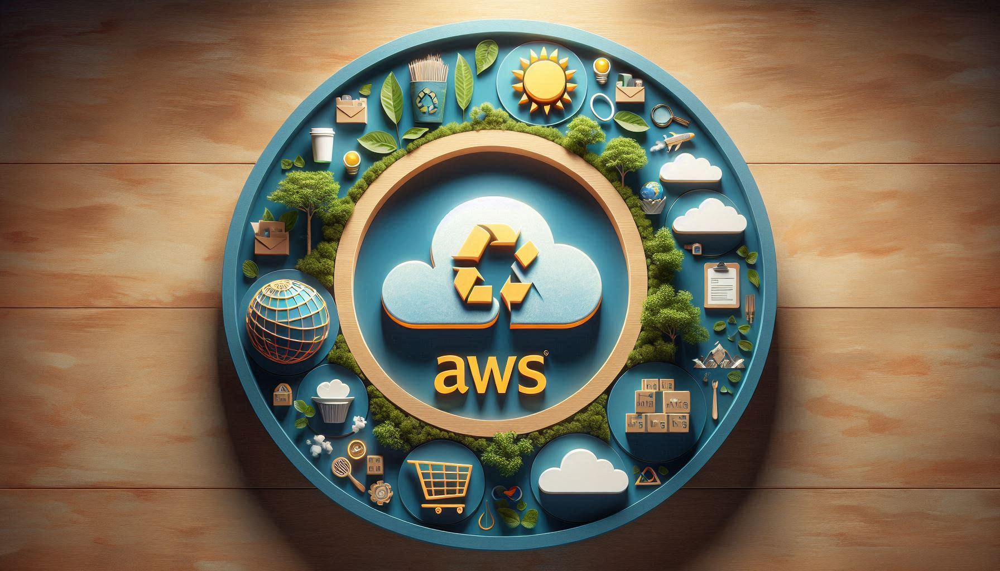

# Unleashing the Potential of Amazon AWS and myHerb: A Path to Sustainable Growth

#### In today’s rapidly evolving digital landscape, the synergy between Amazon AWS and myHerb.co.il presents a unique opportunity for sustainable development and innovation.&#x20;

### **Development Opportunities**

**1. Cloud Computing and Scalability** Amazon AWS offers unparalleled scalability and flexibility, allowing myHerb.co.il to efficiently manage its growing customer base and data needs. By leveraging AWS’s cloud infrastructure, myHerb.co.il can ensure seamless performance during peak times, such as holiday sales or special promotions.

**2. AI and Machine Learning Integration** Integrating AWS’s AI and machine learning services can enhance myHerb’s customer experience. Personalized recommendations, predictive analytics, and automated customer support are just a few ways AI can drive engagement and satisfaction.

**3. IoT for Supply Chain Optimization** AWS IoT services can help myHerb.co.il monitor and optimize its supply chain. Real-time tracking of inventory, predictive maintenance of equipment, and efficient resource management can reduce waste and improve operational efficiency.

<figure><figcaption></figcaption></figure>

### **Growth Tools and Goals**

**1. Data-Driven Marketing** Utilizing AWS’s data analytics tools, myHerb.co.il can gain deeper insights into customer behavior and preferences. This data can inform targeted marketing campaigns, improving conversion rates and customer retention.

**2. Sustainable Practices** Both companies are committed to sustainability. AWS’s energy-efficient data centers and myHerb’s focus on eco-friendly products align perfectly. By promoting sustainable practices, they can attract environmentally conscious consumers and reduce their carbon footprint.

**3. Community Engagement** Building a strong community around myHerb’s products can drive brand loyalty. AWS’s cloud services can support online forums, virtual events, and social media integration, fostering a sense of belonging among customers.

### **Surprising Statistics and Facts**

* [**AWS’s Commitment to Sustainability**: AWS aims to power its operations with 100% renewable energy by 2025](https://community.make.com/t/innovate-sustainably-creating-eco-friendly-scenarios-on-make-com/61227)[1](https://community.make.com/t/innovate-sustainably-creating-eco-friendly-scenarios-on-make-com/61227).
* [**E-commerce Growth**: Global e-commerce sales are projected to reach $6.4 trillion by 2024](https://devsphere.myherb.co.il/)[2](https://devsphere.myherb.co.il/).
* [**Consumer Preferences**: 73% of consumers are willing to change their consumption habits to reduce environmental impact](https://space.myherb.co.il/collaborating/how-we-work-together/unleashing-the-power-of-ai-with-myherbs-innovative-partners)[3](https://space.myherb.co.il/collaborating/how-we-work-together/unleashing-the-power-of-ai-with-myherbs-innovative-partners).

<figure><figcaption></figcaption></figure>

### **Connecting to Trendy Topics**

**1. Green Technology** The integration of green technology is a hot topic. AWS’s renewable energy initiatives and myHerb’s eco-friendly products position them at the forefront of this trend.

**2. Health and Wellness** With a growing focus on health and wellness, myHerb’s herbal products cater to a market that values natural and sustainable options. AWS’s technology can enhance the customer experience by providing personalized health recommendations.

**3. Digital Transformation** The shift towards digital transformation is accelerating. AWS’s robust cloud solutions enable myHerb.co.il to stay competitive by adopting the latest technologies and improving operational efficiency.

<figure><figcaption></figcaption></figure>

#### **Conclusion**


The collaboration between Amazon AWS and myHerb is a testament to the power of technology and sustainability working hand in hand.&#x20;


By leveraging AWS’s advanced tools and myHerb’s commitment to eco-friendly products, both companies can achieve their growth goals while contributing to a greener future.&#x20;

This partnership not only drives business success but also sets a standard for sustainable practices in the industry.

> _Preference:_ [_1_](https://community.make.com/t/innovate-sustainably-creating-eco-friendly-scenarios-on-make-com/61227)[_: AWS Sustainability_ ](https://devsphere.myherb.co.il/)[_2_](https://devsphere.myherb.co.il/)[_: Statista - Global E-commerce Sales_ ](https://space.myherb.co.il/collaborating/how-we-work-together/unleashing-the-power-of-ai-with-myherbs-innovative-partners)[_3_](https://space.myherb.co.il/collaborating/how-we-work-together/unleashing-the-power-of-ai-with-myherbs-innovative-partners)_: Nielsen - Consumer Preferences_
