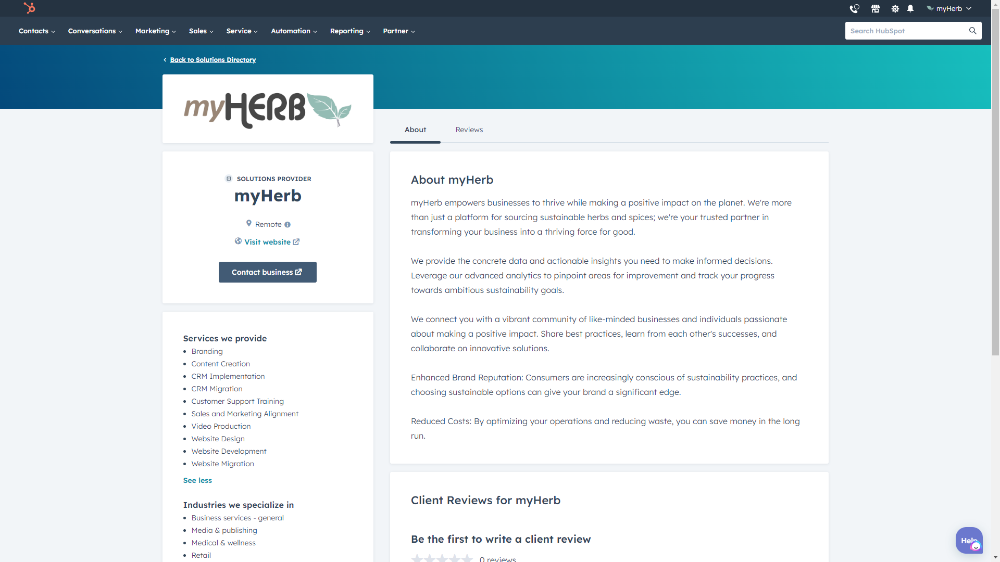

# ⚡ Automate Workflow with HubSpot, Mailchimp, and Customer.io via Zapier

#### In today's marketing landscape, juggling multiple platforms can feel like spinning plates on a unicycle. Contact information gets scattered, updates fall through the cracks, and precious time evaporates on manual tasks. Enter Zapier, the superhero of automation, ready to swoop in and simplify your marketing life.

<figure><figcaption>
myHerb is an Official Solution <a href="https://guide.myherb.co.il/">Partner of HubSpot</a>
</figcaption></figure>

**myHerb** proudly serves as an **Official Solution Partner of** [**HubSpot**](https://guide.myherb.co.il), enabling businesses to enhance their marketing, sales, and service capabilities through comprehensive, integrated solutions. This partnership underscores our commitment to delivering state-of-the-art technologies and strategies tailored to each client's unique needs, fostering growth and operational excellence.


**Learn more and try out HubSpot**: [Click here](https://guide.myherb.co.il) to complete the form. Then, we will send you a unique link for a Trial and Demo. We can also help you with setup and support and enhance your experience with the [HubSpot](https://guide.myherb.co.il/) CRM Suite.


<figure><figcaption>
<a href="https://guide.myherb.co.il/">HubSpot Solution Partner - myHerb</a>
</figcaption></figure>

This post dives into the magic of connecting [HubSpot](https://guide.myherb.co.il), Mailchimp, and Customer.io through Zapier's intuitive interface. Imagine a world where:

* **New HubSpot contact properties trigger automatic subscriber updates in Mailchimp**, ensuring your email lists stay fresh and relevant. No more manual imports!
* **Customer.io seamlessly welcomes new contacts** from [HubSpot](https://guide.myherb.co.il), ready to personalize their journey with targeted messaging. Forget clunky data transfers.
* **Custom field mapping** lets you send additional information from [HubSpot](https://guide.myherb.co.il) (think job title, company, or favorite food!) to personalize your communication across platforms.
* **Zapier's magic extends beyond new contacts.** Based on [HubSpot](https://guide.myherb.co.il) changes, update existing entries in Mailchimp and Customer.io, keeping your data synchronized and accurate.

<figure><figcaption></figcaption></figure>

<figure><figcaption></figcaption></figure>

But here's the real win: **You reclaim your time and energy.** No more copy-pasting data between platforms or checking for missed updates. Zapier handles the heavy lifting, freeing you to focus on crafting compelling content, nurturing leads, and driving marketing magic.

This integration unlocks a treasure trove of possibilities:

* **Trigger targeted email campaigns** based on specific actions taken in [HubSpot](https://guide.myherb.co.il). Downloaded an ebook? Welcome series activated!
* **Segment your Mailchimp audience** based on Customer.io data for hyper-personalized email blasts.
* **Track and analyze email campaign performance** across platforms with integrated analytics tools. Data-driven decisions, anyone?

Zapier isn't just about saving time; it's about unlocking the full potential of your marketing tools. With seamless data flow and automated workflows, you can:

<table data-card-size="large" data-view="cards" data-full-width="false"><thead><tr><th data-type="content-ref"></th><th data-hidden></th><th data-hidden></th><th data-hidden></th><th data-hidden data-card-cover data-type="files"></th><th data-hidden data-type="content-ref"></th><th data-hidden data-type="content-ref"></th><th data-hidden data-type="files"></th><th data-hidden data-type="files"></th><th data-hidden data-type="files"></th><th data-hidden data-card-target data-type="content-ref"></th></tr></thead><tbody><tr><td><a href="./#sync-hubspot-with-mailchimp-and-customer.io">#sync-hubspot-with-mailchimp-and-customer.io</a></td><td></td><td></td><td></td><td><a href=".gitbook/assets/150px@x2 (1).png">150px@x2 (1).png</a></td><td></td><td></td><td><a href=".gitbook/assets/150px@x2 (1).png">150px@x2 (1).png</a></td><td><a href=".gitbook/assets/150px@x2 (1).png">150px@x2 (1).png</a></td><td><a href=".gitbook/assets/150px@x2 (1).png">150px@x2 (1).png</a></td><td><a href="./">.</a></td></tr><tr><td></td><td></td><td></td><td></td><td><a href=".gitbook/assets/myHerb zapier partner program template published - Hubspot-zendesk-customer-io.png">myHerb zapier partner program template published - Hubspot-zendesk-customer-io.png</a></td><td></td><td></td><td></td><td></td><td></td><td></td></tr></tbody></table>

* **Boost marketing efficiency** and close more deals with less manual effort.
* **Personalize every touchpoint** for a customer experience that wows.
* **Gain valuable insights** from unified data to make informed marketing decisions.

So, ditch and embrace the automation revolution. With Zapier, [HubSpot](https://guide.myherb.co.il), Mailchimp, and Customer.io, become a well-oiled machine, propelling your marketing efforts to new heights.

## Sync [HubSpot](https://myherb.co.il/hubspot/) with Mailchimp & Customer.io

Sync [HubSpot](https://guide.myherb.co.il) with Mailchimp & Customer.io “Anytime a new contact property change is created in HubSpot, add/update a subscriber in Mailchimp and create or update a person in Customer.io.

Zapier allows seamless integration between different apps and platforms, making your workflow more efficient and streamlined. One of the many powerful features of Zapier is the ability to create a "zap" that triggers an action in one app based on an event in another app."

### **Manage subscribers on multiple platforms with one Zap**

_In this case, we will use_ [_HubSpot_](https://guide.myherb.co.il)_, Mailchimp, and Customer.io to demonstrate how to automatically add or update subscribers across various platforms with just one zap._

1. First, let's set up the trigger for our zap. In [HubSpot](https://guide.myherb.co.il/), we have a contact property change as our trigger event. Our zap will be triggered whenever a new contact property is created or updated in [HubSpot](https://guide.myherb.co.il).
2. Next, we will select Mailchimp as our action app. We want to add the new or updated contact in [HubSpot](https://guide.myherb.co.il) as a subscriber to our Mailchimp audience. Zapier will automatically pull in all your Mailchimp lists, so you can choose which one to add the subscriber.
3. Once we have selected our action app and account, we can map the fields from our trigger app ([HubSpot](https://guide.myherb.co.il)) to our action app (Mailchimp).&#x20;


This is where Zapier's "magic" happens—it takes information from one app and seamlessly transfers it to another.


<figure><figcaption>
Template created at zapier by myHerb
</figcaption></figure>

### Effortlessly Transfer Contacts Between HubSpot and Mailchimp using Zapier

For example, we can map the first name, last name, and email address fields from [HubSpot](https://guide.myherb.co.il) to the corresponding fields in Mailchimp. This ensures that all contact information is accurately transferred.

But what if we want to add more information, such as the contact's job title or company name? No problem—Zapier allows us to add custom fields to our mapping. This means we can transfer any additional information from [HubSpot](https://guide.myherb.co.il) and have it automatically added to the subscriber's profile in Mailchimp.

In addition to adding new contacts, Zapier can update existing contacts in Mailchimp. This is extremely helpful for keeping our audience data up-to-date without manually changing both apps.

### Streamline Your Marketing Efforts with Zapier's Automation Process

Zapier's automation process saves us time and effort and ensures that our contact information is always accurate and consistent across both platforms. No more worrying about outdated or incomplete subscriber lists – with Zapier, all our data is synced and organized seamlessly.

<figure><figcaption>
<a href="https://guide.myherb.co.il/">myHerb - Official Solution Partner of HubSpot</a>
</figcaption></figure>

<figure><figcaption>
HubSpot full CRM Suite
</figcaption></figure>

But Zapier doesn't just stop at syncing contacts – it can also automate other tasks, such as creating new Mailchimp campaigns based on [HubSpot](https://guide.myherb.co.il) triggers. This means we can easily set up automated email marketing campaigns triggered by specific actions or events within our [HubSpot](https://guide.myherb.co.il) platform."

### Maximizing Email Marketing Efficiency with Zapier Integration

We can also use Zapier to track and analyze the success of our email marketing efforts by integrating Mailchimp with other analytics tools. With Zapier, we have access to powerful reporting features that allow us to monitor the performance of our email campaigns and make informed decisions about future strategies.

<figure><figcaption></figcaption></figure>

In today's fast-paced business world, automation is essential for streamlining processes and maximizing efficiency.&#x20;

> _By using Zapier to connect_ [_HubSpot_](https://guide.myherb.co.il/) _and Mailchimp, we can save time and eliminate manual tasks. This frees up our team to focus on other essential aspects of our marketing strategy, such as creating compelling content or engaging with leads._


### _Plant a Tree with Zapier Template by myHerb:_ [_Click Here_](https://zapier.com/apps/slack/integrations/tree-nation/1620492/plant-trees-with-tree-nation-for-new-slack-reactions)_._


<figure><figcaption>
<a href="https://zapier.com/apps/slack/integrations/tree-nation/1620492/plant-trees-with-tree-nation-for-new-slack-reactions">Plant a Tree with Zapier</a>: Template by myHerb
</figcaption></figure>

### Automated Email Campaigns with Zapier and HubSpot

Furthermore, integration with Zapier opens up endless possibilities for customization and personalization in our campaigns.&#x20;

<figure><figcaption>
myHerb at HubSpot's Solution Partners Directory
</figcaption></figure>


We can use [HubSpot](https://guide.myherb.co.il/) triggers to send targeted emails based on our contacts' specific actions or behaviors. **For example, if a lead downloads an ebook from our website, we can automatically add them to a relevant email campaign that nurtures them through the sales funnel**.

